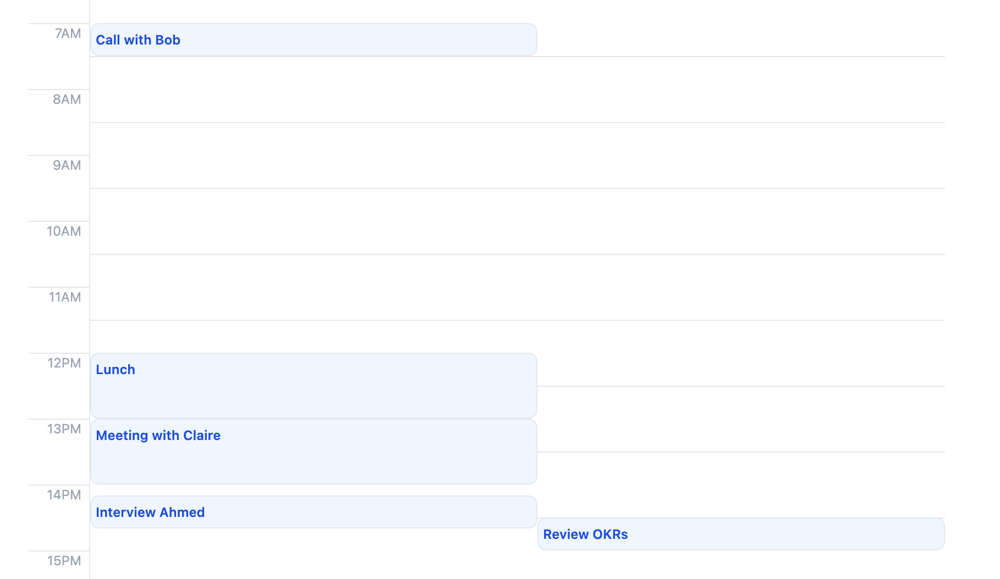

# Pace gets organised 📅

Thank you for taking the time to interview with Pace! The next step will be Live Coding interview with our engineering team. During the call we will do a couple of small improvements to the calendar application which our team developed. To help you in preparing for the interview, we are sending the codebase to you today, allowing you to familiarize yourself with the application and its code.

## Tech Stack

The application is built with [next.js](https://nextjs.org/) but you don't need to know it. During the interview will focus just on the React and GraphQL part. If you haven't used GraphQL before, we can limit the conversation to React part only. Just to let you know, for styling we used [Tailwind](https://tailwindcss.com/) - but you'll not have to do any CSS work on the call. 

## Requirements

Before the interview, we would ask you to prepare your development setup. What you'll need is:
* your IDE of choice,
* [node.js](https://nodejs.org/en) runtime environment,
* this package with installed dependencies (`npm ci`).

Make sure before the interview that `npm run dev` command is working and you're able to access the app by hitting [localhost:3000](http://localhost:3000/).

Good Luck!